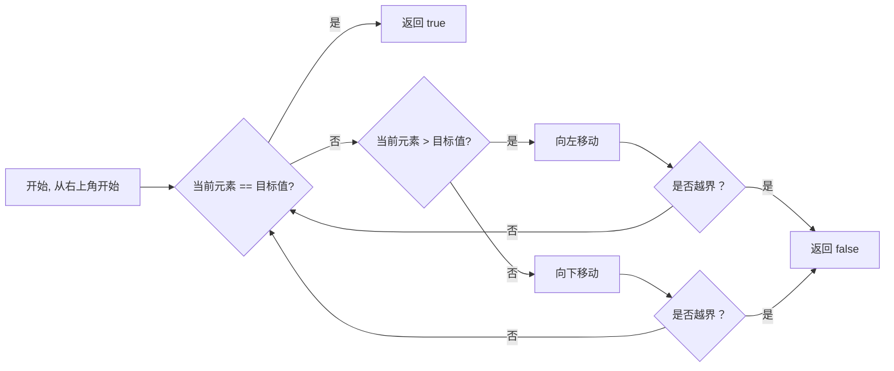

# Hello Spring Boot

Playground for java spring boot and more.

Include:
+ Spring Boot
+ Mybatis
+ H2

```mermaid
graph LR
    A[开始, 从右上角开始] --> B{当前元素 == 目标值?};
    B -- 是 --> C[返回 true];
    B -- 否 --> D{当前元素 > 目标值?};
    D -- 是 --> E[向左移动];
    E --> F{是否越界？};
     F -- 是 --> G[返回 false];
     F -- 否 --> B;
    D -- 否 --> H[向下移动];
    H --> I{是否越界？};
     I -- 是 --> G;
     I -- 否 --> B;

```
